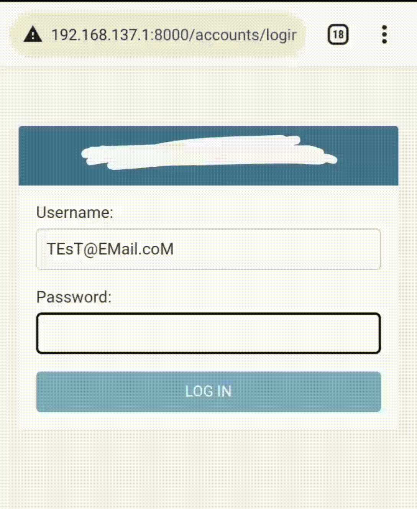

===============================
Django Multiple Authentication
===============================

.. image:: https://readthedocs.org/projects/django-multiple-authentication/badge/?version=latest
    :target: https://django-multiple-authentication.readthedocs.io/en/latest/?badge=latest
    :alt: Documentation Status

Django Multiple Authentication allows you to use either email or username field or any other
field on your user model for your user authentication.

Source code
 https://github.com/KoredeDavid/django-multiple-authentication/

Documentation
  https://django-multiple-authentication.readthedocs.io/en/latest/

-------------------------------------------------------------------------------

Rationale
----------------

Django's default authentication only accepts username for user authentication.
So the package allows you to use either email or username or any other stuff on your user table for user authentication.
It works with django's in-built authentication function, so
it works as long as django's authentication function is called.

Requirements
------------

* Python >= 3.6
* Django (3.0, 3.1, 3.2, 4.0, 4.1)

These are the officially supported python and django package versions.  Other versions
will probably work.

Installation
-------------

Django Multiple Authentication can be installed with pip:

.. code-block:: console

    pip install django
    pip install django-multiple-authentication

Project Configuration
------------------------

Add ``multiple_auth`` to your list of ``INSTALLED_APPS`` in your ``settings.py`` :

.. code-block:: python

    INSTALLED_APPS = [
        ...
        "multiple_auth",
   ]

Now we tell django what ``AUTHENTICATION_BACKENDS`` we want to use for user authentication.
Update your ``settings.py`` with this:

.. code-block:: python

    AUTHENTICATION_BACKENDS = (
        'multiple_auth.backends.MultipleAuthentication',
    )

Usage & Illustration
============
Startup up a new project like this if you haven't::
  
   django-admin startproject sampleproject

   cd sampleproject

   python manage.py makemigrations

   python manage.py migrate

Create a superuser::

    python manage.py createsuperuser --username='test' --email='test@email.com'

 It will bring a prompt to set ``password``. So just set your password and you're done creating a user.

Now we tell django what ``AUTHENTICATION_BACKENDS`` we want to use for user authentication.
Update your ``settings.py`` with this:

.. code-block:: python

    AUTHENTICATION_BACKENDS = (
        'multiple_auth.backends.MultipleAuthentication',
    )

Add ``MULTIPLE_AUTH`` settings (a dictionary) to your settings.py. Include a key of ``auth_fields`` a value of the list of
field(s) in your User Model you want to accept for your authentication.

You can use one or more fields. For illustration,
we will be using the ``username`` and ``email`` fields. So update your settings like this:

.. code-block:: python

    MULTIPLE_AUTH = {
        'auth_fields': ['username', 'email']
    }

You can test it with your login page or your API. It works also on the django-admin panel.

Note that the the ``auth_fields`` is not just limited two fields you can have one, two or more fields.

One Field:

.. code-block:: python

    MULTIPLE_AUTH = {
        'auth_fields': ['id']
    }

Two OR More fields

.. code-block:: python

    MULTIPLE_AUTH = {
        'auth_fields': ['email', 'username', 'phone_number', 'id', ...]
    }

    Here's a GIF showing a user logging in with his ``email``, ``username`` and ``id``.

.. admonition:: NOTE

    It also works with **Django Admin** and **REST APIs!!!**